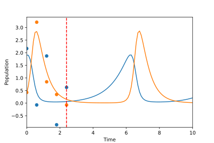
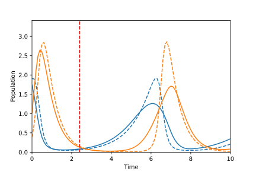
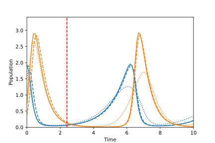

===========
Quick Start
===========

Installation
------------

This project is available on pypi!
Install with::

    pip install trajectory_manifold

This project depends on `jax 0.4.3+ <https://github.com/google/jax>`_, `diffrax 0.3.0+ <https://github.com/patrick-kidger/diffrax>`_, and `jaxtyping <https://github.com/google/jaxtyping>`_.

Note that jax installation is a bit more specialized and requires selection
dependent on your particular system. Thus, it is advised that you install it before this package.

This tutorial additionally uses the library `optax <https://github.com/deepmind/optax>`_ for gradient-based optimization.

Problem Setup
-------------

The key insight in this project is to interpret forecasting of ODE based 
systems as a reparameterization of the state estimation problem.
Throughout the remainder of the quickstart page, we demonstrate
a method to do minimum mean squared error estimation (MMSE) on the manifold of
solutions to a differential equation.

In this example, we will use the Lotka-Volterra system, provided in the
``examples`` module of the library.
This periodic system represents a simple predator-prey population model.

.. math::

    \begin{aligned}
       \dot{x}^{(1)} &= \alpha x^{(1)} - \beta x^{(1)} x^{(2)} \\
       \dot{x}^{(2)} &= \delta x^{(1)}x^{(2)} - \gamma x^{(2)}
    \end{aligned}

We begin by initializing the system and choosing the parameters for the 
ODE solvers.

.. code-block:: python

    from trajectory_manifold import examples
    from trajectory_manifold.manifold import SolverParameters
    from diffrax import Heun, ConstantStepSize

    vector_field = examples.lotka_volterra_vector_field(1,2,4,2)

    parameters = SolverParameters(stepsize_controller = ConstantStepSize(),
                                  step_size_internal = 0.05,
                                  step_size_output = 0.1,
                                  time_interval = (0,10.1),
                                  solver = Heun(),
                                  max_steps = 16**5)

Next, we construct a helper function to compute solutions of the ODE given
a collection of initial conditions.
To do so, we wrap ``diffeqsolve`` from Diffrax to construct a representation
of :math:`\psi`, or the transformation from initial conditions to the manifold of solutions.
We additionally include an automatic vectorization of :math:`\psi` using ``vmap`` in Jax.

While code is included here, see the the documentation for Jax and Diffrax for more
information.

.. code-block:: python

    from diffrax import ODETerm, SaveAt, diffeqsolve
    from jax import jit, vmap
    import jax.numpy as jnp

    term = ODETerm(vector_field)
    solver = parameters.solver
    system_parameters = ()
    observation_times = jnp.arange(parameters.time_interval[0], 
                                   parameters.time_interval[1], 
                                   step=parameters.step_size_output)

    saveat = SaveAt(ts = observation_times)

    stepsize_controller = PIDController(rtol = parameters.relative_tolerance,
                                        atol = parameters.absolute_tolerance)

    @jit
    def SolveODE(initial_state):
        return diffeqsolve(term,
                           solver,
                           t0 = parameters.time_interval[0],
                           t1 = parameters.time_interval[1],
                           dt0 = parameters.step_size_internal,
                           saveat = saveat,
                           stepsize_controller = stepsize_controller,
                           y0 = initial_state).ys

    solveODE_v = vmap(SolveODE)

Next, define our likelihood function and prior.
We will consider the case of additive standard multivariate Gaussian noise,
where the conditional distribution of the observation given the state is given
by the following.

.. math::

   p(\mathbf{y}|\mathbf{x}) = \frac{1}{2\pi}e^{-\frac{\|\mathbf{y}-\mathbf{x}\|^2}{2}}.

We further assume a uniform prior over a feasible set of initial conditions.

.. math::

   p(\mathbf{x}) = \begin{cases}
        1/4 & \mathbf{x} \in [0.2,2.2] \times [0.2,2.2] \\
        0 & \text{otherwise}
        \end{cases}

For numerical stability, we will encode these in terms of their log likelihood
and their log prior.

.. code-block:: python

    from math import pi

    def observation_log_likelihood(observation, state):
        """Compute log p(y|x) for a given observation and state"""
        partition = jnp.power(2 * pi, -observations.shape[1]/2.0)
        return jnp.log(partition) - jnp.sum(jnp.square(observation - state))/2

    def state_log_prior(state, system_parameters):
        """Compute log p(x) for a given state"""
        return -1 * jnp.log(4)

Generate Observations
---------------------

We next simulate an observation process.
To do so, we solve the ODE and add noise to each sample.
As the focus is forecasting with limited data, we then only take 5 measurements, each spaced by 0.6 seconds of simulation time.

.. code-block:: python

    from jax import random

    dimension = 2
    subsample = 6
    center = 1.2 

    key = random.PRNGKey(123)
    key, subkey = random.split(key)
    true_init = 2 * random.uniform(subkey, shape=(dimension,)) + center - 1

    states = SolveODE(true_init)

    key, subkey = random.split(key)
    noise = random.normal(subkey, shape=states.shape)
    observations = states + noise
    observation_times = observation_times[:30:subsample]
    observations = observations[:30:subsample,:]

In the plot below, the solid lines represent the predator and prey populations, the dots represent our observations, and the vertical dashed red line represents the final observation time.

Given the observation data and the known ODE model, our goal is to predict the entire predator-prey population curve over the 10 second time interval.

State Posterior
---------------

We now use the ``estimation`` module to convert our log likelihood, log prior,
and observations, and system definitions into an unnormalized log posterior.
The following code constructs a function ``posterior_state`` which
represents

.. math::

   \tilde{p}(\mathbf{x}|\mathbf{y}) = \frac{p(\mathbf{x}|\mathbf{y})}{Z}

for some unknown constant :math:`Z`.

.. code-block:: python

    from trajectory_manifold import estimation

    log_posterior_state = estimation.state_log_posterior(vector_field,
                                                         observations,
                                                         observation_times,
                                                         observation_log_likelihood,
                                                         state_log_prior,
                                                         parameters)

    @jit
    def posterior_state(state):
        return jnp.exp(log_posterior_state(state, system_parameters))

For sampling applications, it is desirable to have a vectorized version
of ``posterior_state``, which can be constructed using ``vmap``, below.

.. code-block:: python

    posterior_state_v = vmap(posterior_state)

Importance Sampling
-------------------

We now compute the ambient minimum mean squared error (MMSE) trajectory
through importance sampling.

While more sophisticated sampling techniques may be used,
we approximate the conditional expectation as

.. math::

   \hat{\mathbf{x}}_{\text{MMSE}} = \frac{\sum_{i=1}^S \psi(\mathbf{X}_i) p(\mathbf{X}_i | \mathbf{y})}{\sum_{i=1}^S p(\mathbf{X}_i | \mathbf{y})},

where each :math:`\mathbf{X}_i` is drawn i.i.d. from the prior distribution.

Next, compute 100000 samples of initial conditions from our prior distribution.

.. code-block:: python

    sample_count = 100000
    key, subkey = random.split(key)
    samples = 2 * random.uniform(subkey, shape=(sample_count, dimension,)) + center - 1

Compute the associated solutions and unnormalized distributions.

.. code-block:: python

    sample_weights = posterior_state_v(samples)
    sample_sols = solveODE_v(samples)

Finally, compute the estimate by averaging the trajectories.

.. code-block:: python

    estimate = jnp.sum(sample_weights[:,None,None] * sample_sols, axis=0)/jnp.sum(sample_weights)

In the plot below, we see the true predator-prey populations over time as dashed lines, while the MMSE estimate based on the previous observations as solid lines.
The key observation is that, while the MMSE estimate is optimal, it suffers from oversmoothing the further beyond the observed region the forecast extends.
Thus, while the function fits the probability distribution in some sense, it does not result in a valid solution of the differential equation, and does not qualitatively capture the structure of the future.

Projection
----------

Finally, we project the unconstrained solution onto the manifold.
This results in the constrained MMSE solution by the orthogonality principle.

Because the manifold is curved, this is not a linear projection.
We instead use ``optax`` to optimize through a gradient descent.

Begin by computing the pullback of the gradient on the manifold through the ODE solver.
To do so, we provide the function ``distance_gradient``.

.. code-block:: python

    from trajectory_manifold import optimize

    g = lambda state: optimize.distance_gradient(state,
                                                 system_parameters,
                                                 vector_field,
                                                 estimate,
                                                 parameters)[0]
    g = jit(g)

Next, import ``optax`` and configure the learner.
For this example, we will use the ADAM optimizer.

.. code-block:: python

    import optax

    start_learner_rate = 1e-1
    optimizer = optax.adam(start_learner_rate)

Choose an arbitrary initialization.

.. code-block:: python

    state = jnp.ones(2) * .4
    opt_state = optimizer.init(state)

Apply steps of the ADAM optimizer to compute the MMSE estimate.

.. code-block:: python

    step_count = 100

    for i in range(step_count):
        grads = g(state)
        updates, opt_state = optimizer.update(grads, opt_state)
        state = optax.apply_updates(state, updates)[0]

The variable ``opt_state`` now contains :math:`\psi^{-1}(\hat{\mathbf{x}})`.
We must solve the ODE one final time to compute our estimate.

.. code-block:: python

   trajectory_estimate = SolveODE(state)

Finally, we show the results of our projection onto the manifold of feasible trajectories in the image below.
The solid lines represent the MMSE estimate on the manifold, the dashed lines represent the true populations, and the dotted line represents the MMSE estimate in the ambient space.
Note that the projection does a significantly better job capturing the periodic structure of the solution space.

Below, we include a video of the convergence of the ADAM optimizer, demonstrating the path of points in the gradient based optimization.

.. video:: _static/assets/converge.mp4

